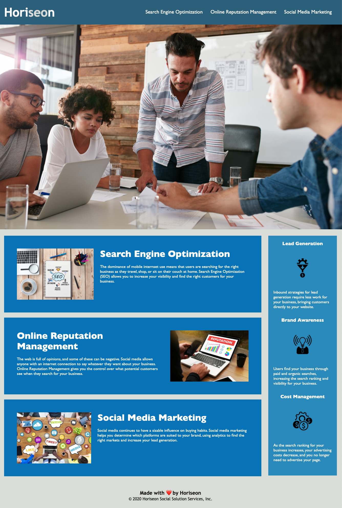
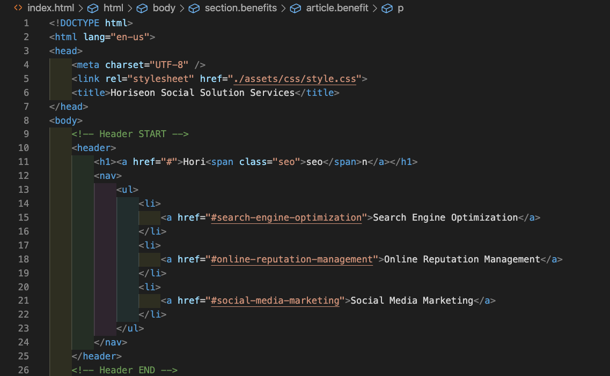
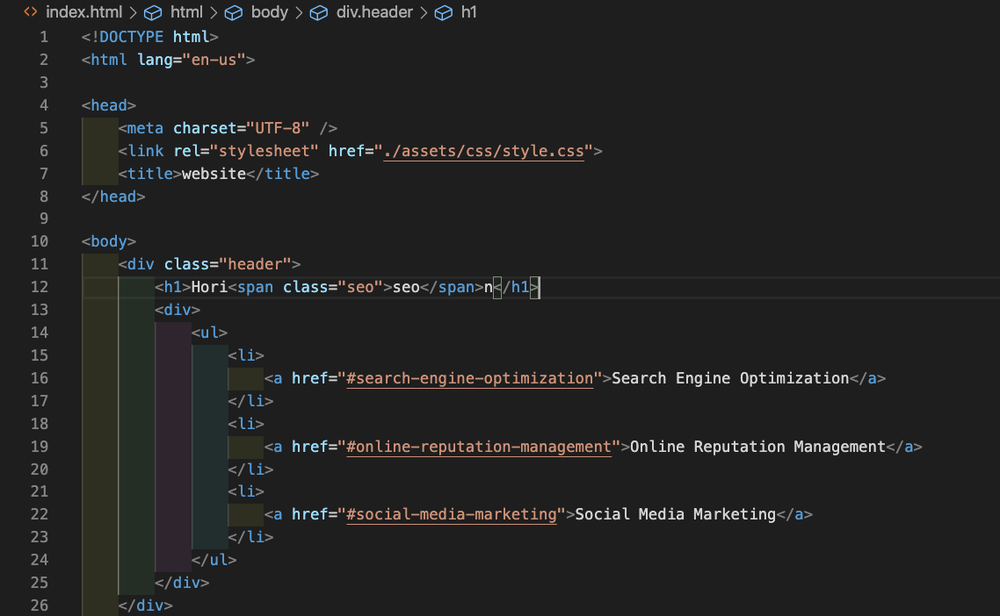
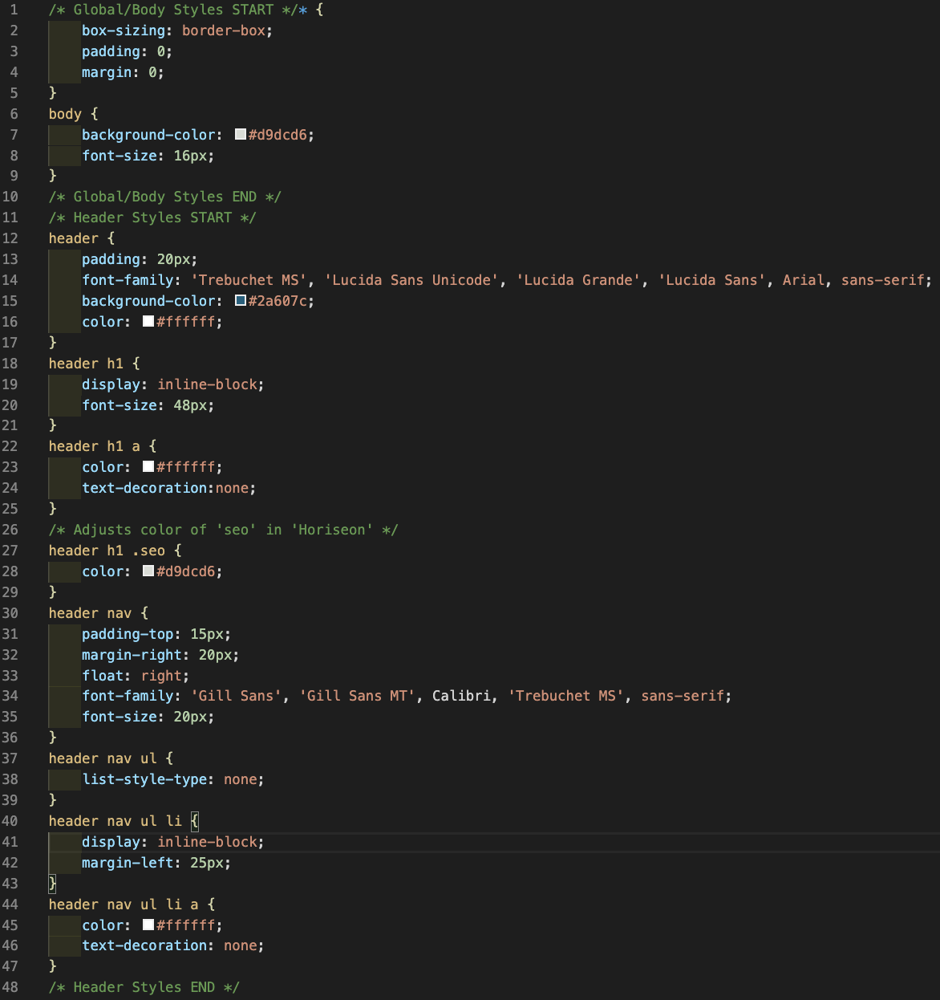
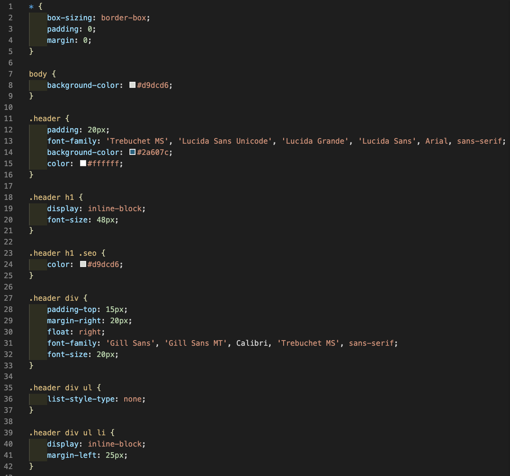

# Challenge 1: Code Refactor | QS

For this week's challenge, we completed a code refactor of the Horiseon Social Solution Services homepage to optimize it for accessibility and efficiency. 

The refactored site has been deployed at [this link](https://quaylas.github.io/qs.coderefactor.wk1/).

Table of Contents
* [Key Changes](key-changes)
* [Images](images)

---

## Key Changes

### Changes to Support Accessibility/SEO

* Generic `
` elements replaced with appropriate semantic HTML elements.
* Images updated to include `alt`/`title` attributes.

### Changes to Support Efficiency/Sustainability

* Element classes consolidated where possible.
* CSS ordered to align with HTML file.
* Comments added to HTML and CSS files for clarity.
* Navigation links tested and updated as needed.
* Footer copyright updated to current year.

---

## Images
### Deployed Updates
The refactored site displays almost identically to the original, as shown below.

### HTML Comparison
HTML has been updated to leverage semantic HTML elements. 

Updated HTML for Header/Navigation:

Original HTML for Header/Navigation:

### CSS Comparison
CSS has been ordered to align with the HTML file, leverage consolidated classes wherever possible, and identify sections with comments.

Updated CSS:

Original CSS:
