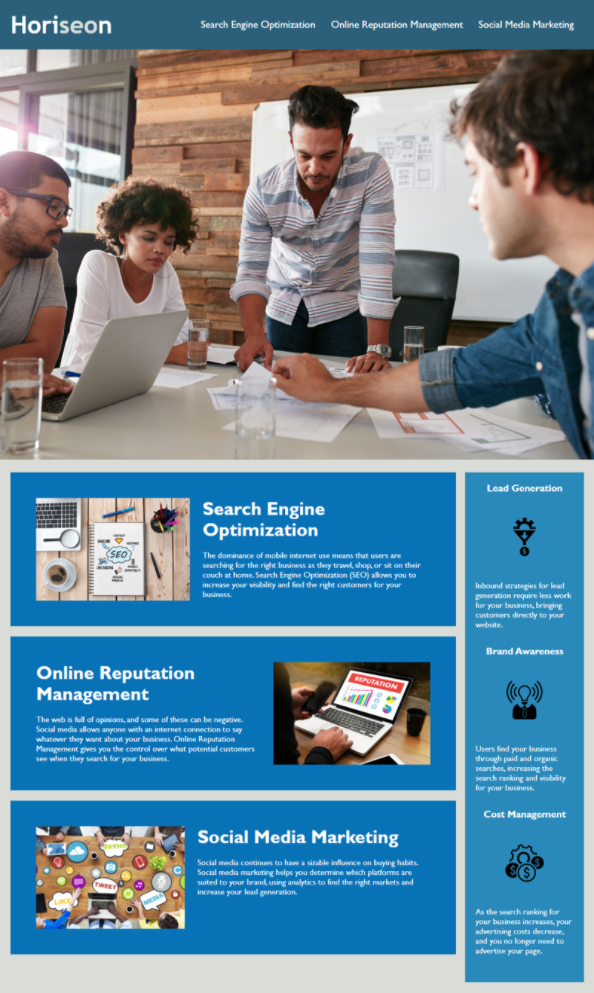

# Challenge 1: Code Refactor | QS

For this week's challenge, we completed a code refactor of the Horiseon Social Solution Services homepage to optimize it for accessibility and efficiency. 

The refactored site has been deployed at [this link](https://quaylas.github.io/qs.coderefactor.wk1/).

Table of Contents
* [User Story and Acceptance Criteria](user-story-and-acceptance-criteria)
* [Key Changes](key-changes)
* [Images](images)

---

## User Story and Acceptance Criteria

### User Story
```
AS A marketing agency
I WANT a codebase that follows accessibility standards
SO THAT our own site is optimized for search engines
```

### Acceptance Criteria
```
WHEN I view the source code
THEN I find semantic HTML elements
```
```
WHEN I view the structure of the HTML elements
THEN I find that the elements follow a logical structure independent of styling and positioning
```
```
WHEN I view the image elements
THEN I find accessible alt attributes
```
```
WHEN I view the heading attributes
THEN they fall in sequential order
```
```
WHEN I view the title element
THEN I find a concise, descriptive title
```
---

## Key Changes

### Changes to Support Accessibility/SEO

* Generic `<div>` elements replaced with appropriate semantic HTML elements.
* Images updated to include `alt`/`title` attributes.

### Changes to Support Efficiency/Sustainability

* Element classes consolidated where possible.
* CSS ordered to align with HTML file.
* Comments added to HTML and CSS files for clarity.
* Navigation links tested and updated as needed.
* Footer copyright updated to current year.

---

## Images
### Deployed Updates
The refactored site displays almost identically to the original, as shown below.

Site Deployed with Updates:


Mockup Provided:



### HTML Comparison
HTML has been updated to leverage semantic HTML elements. 

Updated HTML for Header/Navigation:


Original HTML for Header/Navigation:


### CSS Comparison
CSS has been ordered to align with the HTML file, leverage consolidated classes wherever possible, and identify sections with comments.

Updated CSS:


Original CSS:

